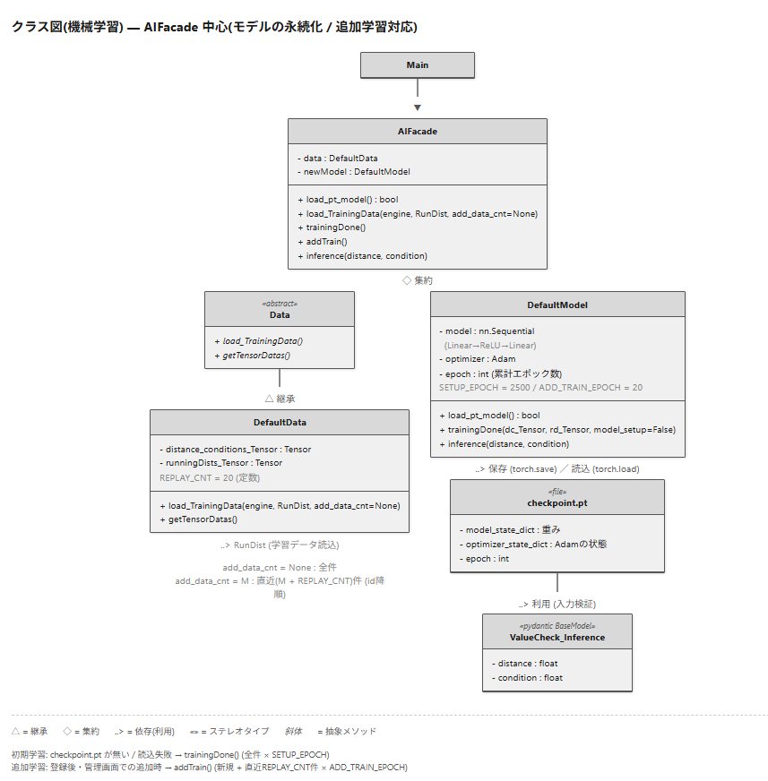
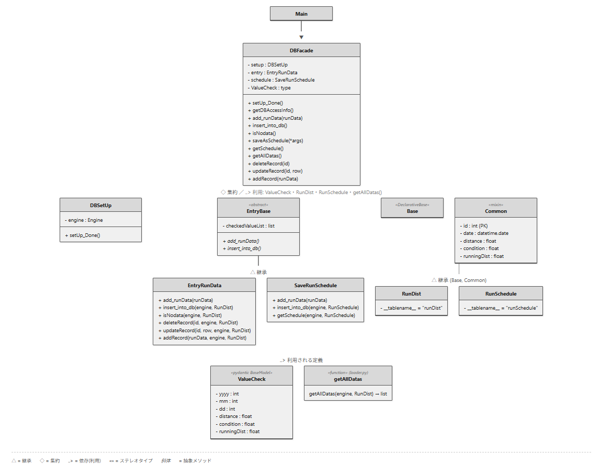

# ランニングサポートAI

過去のランニング記録をもとに、AIがその日の「実際に走る距離(km)」の目安を提示するアプリです。

## デモ動画
まずは動作デモにてどのようなアプリなのか確認してください。


https://github.com/user-attachments/assets/61353c9e-be06-4216-ab72-166026658457


## ■アプリ概要
このアプリは、ランニングで **「実際に走る距離(km)」** を決めるためのアプリです。  
ランニング前に「走行予定の距離(km)」と「その日の体調(%)」を入力すると、過去の記録を学習したAIが **「実際に走る距離(km)」** の目安を算出します。  
Python 3.10〜3.12 が動作する環境であれば利用でき、オフラインで動作します。

## ■技術選定
- **Webフレームワーク：FastAPI**
  REST APIの「リクエスト・レスポンス・JSON」という概念をそのまま扱えるFastAPIを採用しました。  
  本アプリは「ローカル環境で単一ユーザーが使うこと」を前提としているため、Djangoのように多くの機能をデフォルトで備えたフレームワークよりも、軽量なFastAPIが適していると判断しました。
- **ORM：SQLAlchemy**
  FastAPIと組み合わせるORMとして採用しました。公式チュートリアルでSQLAlchemyとの連携が示されているためです。
- **機械学習：PyTorch**
  走行予定距離と体調から実際の走行距離を推定する、シンプルな推論モデルに利用しています。

## ■アーキテクチャ
module層のDBアクセスとAI推論をFacade(`DBFacade` / `AIFacade`)で隠蔽し、API層から内部構造を意識せず呼び出せるようにしています。  
これにより、AIモデルやDBの実装を変更してもAPI層に影響が及ばない疎結合な構成を狙いました。

### ディレクトリ構成(簡易ver)
```
src/
├── my_modules/          # facade.pyで定義した自作モジュール「AIFacade」「DBFacade」からすべてのバックエンド機能を呼び出す
│
├── webApp/
│   ├── __init__.py
│   ├── api/            # APIを作成（自作モジュール「AIFacade」「DBFacade」はここで利用）
│   ├── static/         # 静的ファイル
│   └── templates/      # フロントエンド画面
│
├── __init__.py
├── app.db
├── int_code.py          #管理画面は"uvicorn int_code:app --reload"コマンドで実行してください
└── main.py              #ファイルを実行すると自動でuvicornサーバを起動

※自作モジュール「AIFacade」「DBFacade」については以下のクラス図に記載
```

<details>
  <summary>クラス図(機械学習)</summary>
  <br/>
  <p>※補足</p>
  <ol>
    <li>赤字部分：DBの接続情報(≒engine)とORM(≒RunDist)を指す</li>
    <li>青字部分：ランニング記録をAIが学習可能な2次元並列型に変換したもの</li>
  </ol>
</details>
<details>
  <summary>クラス図(DB登録(ランニング記録))</summary>
  <br/>
</details>

## ■技術的な工夫
本アプリはランニングのモチベーション維持を主目的としているため、機械学習モデルは意図的にシンプルな構成とし、推論精度よりも日常的な使い勝手を優先しました。

実装面で工夫したのはDBへの登録処理です。ランニング記録は画面上で1件ずつ入力しますが、「登録」のたびにINSERTを発行するのではなく、入力データを一旦アプリ側で保持し、登録作業の完了時に全件をまとめてバルクINSERT(一括登録)する設計にしました。これにより、DBへのラウンドトリップとトランザクション発行の回数を削減し、登録件数が増えても処理コストが線形に膨らみにくい構成を狙いました。

## ■品質面
- module層(DBアクセス・AI推論を担うFacade)はpytestで単体テストを作成し、主要な処理の動作を検証しています。テストは `pytest` コマンドで実行できます。
- FastAPI / Pydantic を採用しており、リクエスト・レスポンスやデータモデルに型ヒントを活用しています。

## ■使用環境
- OS：Windows 11(x64ベースシステム)
- エディタ：VSCode(推奨)、Spyder(Anaconda / conda環境)
- 言語：Python 3.11.14（対応バージョン：3.10〜3.12）
- 主なライブラリ：fastapi / sqlalchemy / pytorch

## ■実行方法
1. 本リポジトリをcloneする。
2. `src/main.py` を実行するとサーバーが起動します。
3. 5秒ほど待つとブラウザが自動で起動します。画面の案内に従い、「ランニング記録の入力」または「AIによる走行距離の算出」を行ってください。

※本アプリはオフライン環境で動作します。
