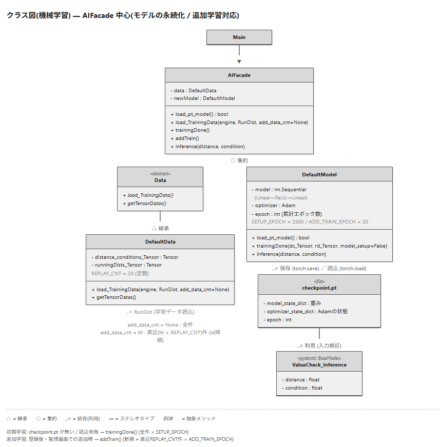
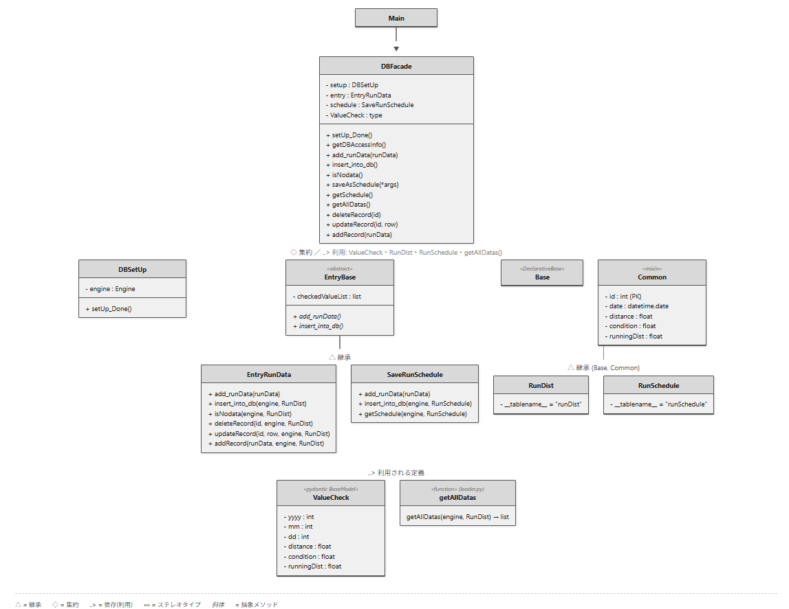

# ランニングサポートAI

過去のランニング記録をもとに、AIがその日の「実際に走る距離(km)」の目安を提示するアプリです。

## デモ動画
まずは動作デモにてどのようなアプリなのか確認してください。


https://github.com/user-attachments/assets/b7e5cfdc-e752-47b7-ae93-f02b4d309a5d


## ■アプリ概要
このアプリは、ランニングで **「実際に走る距離(km)」** を決めるためのアプリです。  
ランニング前に「走行予定の距離(km)」と「その日の体調(%)」を入力すると、過去の記録を学習したAIが **「実際に走る距離(km)」** の目安を算出します。  
Python 3.10〜3.12 が動作する環境であれば利用でき、オフラインで動作します。  
またこのリポジトリの画面右側「Releases」よりexe版のアプリを取得可能です (この場合はPython実行環境は不要です)。  
> 注意: exe版はOS: Windows11(64bit版)に対応しています。その他のOSには対応しておらず、実行時に発生した不具合に対する責任はこちらで負わないものとします (免責事項の詳細は[LICENSE](./LICENSE)参照)  
> 　　またProgram Files 配下など書き込み権限のない場所にzipファイルを展開しないでください。


## ■技術選定
- **Webフレームワーク：FastAPI**
  REST APIの「リクエスト・レスポンス・JSON」という概念をそのまま扱えるFastAPIを採用しました。  
  本アプリは「ローカル環境で単一ユーザーが使うこと」を前提としているため、Djangoのように多くの機能をデフォルトで備えたフレームワークよりも、軽量なFastAPIが適していると判断しました。
- **ORM：SQLAlchemy**
  FastAPIと組み合わせるORMとして採用しました。公式チュートリアルでSQLAlchemyとの連携が示されているためです。
- **機械学習：PyTorch**
  走行予定距離と体調から実際の走行距離を推定する、シンプルな推論モデルに利用しています。

## ■アーキテクチャ
module層のDBアクセスとAI推論をFacade(`DBFacade` / `AIFacade`)で隠蔽し、API層から内部構造を意識せず呼び出せるようにしています。  
これにより、AIモデルやDBの実装を変更してもAPI層に影響が及ばない疎結合な構成を狙いました。
またAIモデルの学習内容は`checkpoint.pt`に永続的に保存します (exe版では exe と同じフォルダに保存します)

### ディレクトリ構成(簡易ver)
```
src/
├── my_modules/          # facade.pyで定義した自作モジュール「AIFacade」「DBFacade」からすべてのバックエンド機能を呼び出す
│
├── webApp/
│   ├── __init__.py
│   ├── api/            # APIを作成（自作モジュール「AIFacade」「DBFacade」はここで利用）
│   ├── static/         # 静的ファイル
│   └── templates/      # フロントエンド画面
│
├── __init__.py
├── app.db               # アプリ初回起動時に自動生成
├── checkpoint.pt        # 機械学習の結果を永続保存
└── main.py              # ファイルを実行すると自動でuvicornサーバを起動

※自作モジュール「AIFacade」「DBFacade」については以下のクラス図に記載
```

<details>
  <summary>クラス図(機械学習)</summary>
  <br/>
</details>
<details>
  <summary>クラス図(DB登録(ランニング記録))</summary>
  <br/>
</details>

## ■技術的な工夫
本アプリはランニングのモチベーション維持を主目的としているため、機械学習モデルは意図的にシンプルな構成とし、推論精度よりも日常的な使い勝手を優先しました。

実装面で工夫したのはDBへの登録処理です。ランニング記録は画面上で1件ずつ入力しますが、「登録」のたびにINSERTを発行するのではなく、入力データを一旦アプリ側で保持し、登録作業の完了時に全件をまとめてバルクINSERT(一括登録)する設計にしました。これにより、DBへのラウンドトリップとトランザクション発行の回数を削減し、登録件数が増えても処理コストが線形に膨らみにくい構成を狙いました。
登録を確定する前であれば「取り消し」で未確定の記録をまとめて破棄でき、タブを移動しても自動では登録・学習しません(誤登録を防ぐため)。

## ■品質面
- module層(DBアクセス・AI推論を担うFacade)はpytestで単体テストを作成し、主要な処理の動作を検証しています。テストは `pytest` コマンドで実行できます。
- API層は FastAPI の TestClient で画面遷移・登録・学習の流れをテストしています。
- FastAPI / Pydantic を採用しており、リクエスト・レスポンスやデータモデルに型ヒントを活用しています。

## ■使用環境
.```devcontainer/```以下のファイルを用いて以下の環境を構築可能です。
- OS：Linux
- エディタ：VSCode(拡張機能「Dev Container」をインストール)
- 言語：Python 3.11.15
- 主なライブラリ：fastapi / sqlalchemy / pytorch  
※詳細は```requirements.txt```参照

## ■実行方法
### ソースコード実行時
1. 本リポジトリをcloneする。
2. VSCodeを開きコンテナを起動する(Reopen in Container)。
3. `src/main.py` を実行するとサーバーが起動します。
4. 2~5秒ほど待つとブラウザが自動で起動します。画面上部のタブで「登録」と「推論」を切り替えて操作してください。
   - 初回起動時(記録0件)は「登録」タブが開きます。ランニング記録を入力して「登録」を押し、入力が終わったら「登録終了&学習」を押すと、記録が保存され、AIが学習します。
   - 「登録終了&学習」を押す前であれば、「取り消し」で入力した記録をまとめて破棄できます。
   - 「推論」タブで走行予定の距離と体調を入力して「AI実行」を押すと、AIが実際に走る距離の目安を回答します。
5. 推論タブの「予定として保存」を押すと、AIの回答が次回の予定として保存され、登録タブの入力欄に自動で入ります。
6. 画面右上の「管理画面」から、ランニング記録の管理画面(/intcode/)を表示できます。
   このページにて1か月間のランニングのアナリティクスや、アプリに保存済みのランニング記録を参照可能です。

### アプリ (exeファイル)実行時
1. このリポジトリの画面右側「Releases」よりzipファイルを取得してください。
2. zipファイルを解凍してください。  
> 注意: **Program Files 配下など書き込み権限のない場所に展開しないでください。**  
> 解凍したフォルダには `runningAI.exe` と `_internal` フォルダが同梱されています。**`runningAI.exe` を単体で別の場所に移動・コピーしないでください**(`_internal` フォルダと同じ場所に置いたまま実行する必要があります)。
3. `runningAI.exe` を実行してください。  
> 注意: 未署名のexeファイルのため、初回実行時に「WindowsによってPCが保護されました」というSmartScreenの警告が表示されることがあります。その場合は「詳細情報」→「実行」を選択してください。
4. 上記「ソースコード実行時」の手順4以降に従い操作してください。
5. アプリを終了する際は、画面右上の「アプリ終了」ボタンをクリックしてください。ウィンドウの×ボタンやタスクバーから閉じると、exeプロセスがバックグラウンドに残る場合があります。

※本アプリはオフライン環境で動作します。
